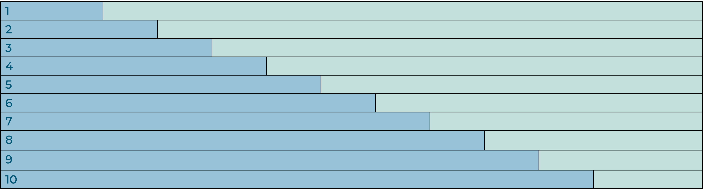
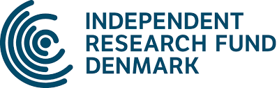

#### Background

Minor head trauma accounts for a substantial proportion of emergency department visits globally. Approximately half of these patients undergo CT scanning to rule out intracranial haemorrhage requiring intervention. However, the vast majority of scans are without clinically relevant findings, and only 0-1% result in neurosurgical intervention. We aim to evaluate a new management algorithm developed by the Danish Choosing Wisely organization against the 2013 Scandinavian Neurotrauma Committee guidelines.

We hypothesize that the Choosing Wisely algorithm will reduce CT use by of 25-30% without compromising patient safety.

#### Aim

HEADWISE aims to compare a new *Choosing Wisely* recommendation with the current guidelines from the Scandinavian Neurotrauma Committee (SNC). The new recommendation is expected to reduce CT utilization by 25% without compromising patient safety

::: {.methods-section}
#### Methods

A stepped-wedge multicenter cluster-randomized non-inferiority trial including 10 Danish emergency departments, covering all five Danish regions. 

Each department will serve as a cluster, initially following the Scandinavian guidelines before sequentially transitioning to the Choosing Wisely guidelines by random selection. Eligible patients are adults (>18 years) presenting within 24 hours of head trauma with a Glasgow Coma Scale score of 14-15 at admission. 

{fig-align="left" width="660"}

The primary outcome is the proportion of patients undergoing neurosurgery. Secondary outcomes include mortality, length of hospital stay, CT scan rates, and economic impact. Data will be obtained from national healthcare registers and only data part of routine clinical documentation will be needed. Approximately 7000 patients will be included. For continuous outcomes, a linear mixed-effects model will be used. For binary outcomes, a logistic mixed-effects model will be used. Time-to-event analyses will assess mortality and other temporal endpoints.

:::

#### Ethics

The study has been approved by the Danish Research Ethics Committees (case no.: 2403883, document no.: 3024022). A simplified informed consent model will be used: Patients will receive printed study information and may opt out of data use without affecting clinical management. Results will be disseminated through peer-reviewed publications and presentations at international scientific conferences.

#### Timeline

Ongoing retrospective data collection and analysis to determine power. Study start 2026.

#### Funding

  
  

