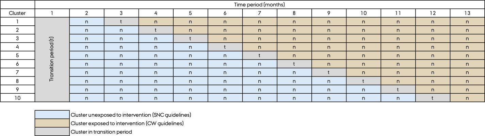

#### Local Visits

The Organizing Committee will visit the 10 participating departments ahead of trial start to inform thoroughly about the study. Posters and flyers will be distributed. The Organizing Committee will also visit the departments several times during the trial period, including at the time of transition.

+---------------------+-------------------------+------------------------------------------------------------------------------------------------------------------+
| Department          | Initial visit           | Second visit                                                                                                     |
+:====================+:========================+==================================================================================================================+
| Aalborg             | xx.xx.2026              |                                                                                                                  |
+---------------------+-------------------------+------------------------------------------------------------------------------------------------------------------+
| Aarhus              |                         |                                                                                                                  |
+---------------------+-------------------------+------------------------------------------------------------------------------------------------------------------+
| Esbjerg             |                         |                                                                                                                   |
+---------------------+-------------------------+------------------------------------------------------------------------------------------------------------------+
| Kolding             |                         |                                                                                                                   |
+---------------------+-------------------------+------------------------------------------------------------------------------------------------------------------+
| Aabenraa            |                         |                                                                                                                   |
+---------------------+-------------------------+------------------------------------------------------------------------------------------------------------------+
| Odense              |                         |                                                                                                                   |
+---------------------+-------------------------+------------------------------------------------------------------------------------------------------------------+
| Slagelse            |                         |                                                                                                                   |
+---------------------+-------------------------+------------------------------------------------------------------------------------------------------------------+

 

#### Transition Scheme

Below the scheme for transition from the Scandinavian guidelines (control) to the Choosing Wisely recommendation (intervention) can be seen.

*To be updated when randomization has taken place.*

{width="1200"}

 

#### Workflow

The clinicians workflow can be seen in the following flowchart.

{width="800"}
